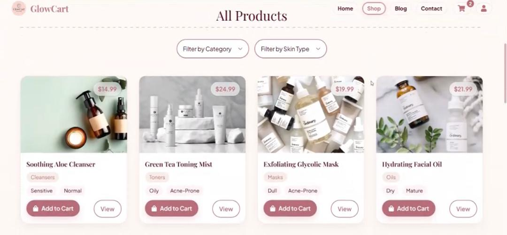
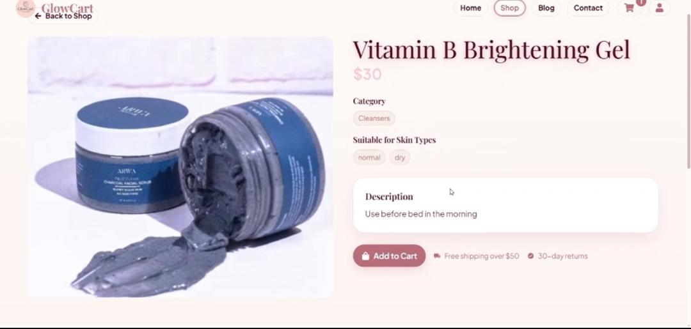

# 🌟 GlowCart - Premium Skincare E-commerce Platform

A modern, full-featured skincare e-commerce platform built with Next.js 15, TypeScript, and Supabase. Discover premium skincare products with an elegant shopping experience.


## 🚀 Live Demo

[View Live Demo](https://glowcart-pi.vercel.app) | [Shop Now](https://glowcart-pi.vercel.app/shop)

## 📋 Table of Contents

- [Features](#-features)
- [Tech Stack](#-tech-stack)
- [Screenshots](#-screenshots)
- [Installation](#-installation)
- [Environment Setup](#-environment-setup)
- [Usage](#-usage)
- [Project Structure](#-project-structure)
- [API Endpoints](#-api-endpoints)
- [Deployment](#-deployment)
- [License](#-license)

## ✨ Features

### 🛍️ E-commerce Core

- **Product Catalog**: Browse premium skincare products with detailed descriptions
- **Advanced Filtering**: Filter by category, skin type, and price range
- **Product Search**: Intelligent search functionality across the entire catalog
- **Product Details**: Comprehensive product pages with images and specifications
- **Category Pages**: Dedicated pages for different skincare categories

### 🛒 Shopping Experience

- **Shopping Cart**: Persistent cart with localStorage integration
- **Cart Modal**: Elegant slide-out cart interface
- **Quantity Management**: Add, remove, and update product quantities
- **Cart Persistence**: Cart state maintained across browser sessions
- **Checkout Process**: Streamlined checkout with shipping information

### 🎨 User Interface

- **Modern Design**: Clean, elegant interface with premium aesthetics
- **Responsive Layout**: Mobile-first design optimized for all devices
- **Hero Section**: Eye-catching homepage with call-to-action
- **Featured Products**: Highlighted product showcase
- **Category Showcase**: Visual category browsing
- **Customer Reviews**: Social proof and testimonials

### 📝 Content Management

- **Blog System**: SEO-optimized blog with markdown support
- **Dynamic Routing**: Automatic slug generation for blog posts
- **Content Management**: Easy-to-manage blog content
- **SEO Optimization**: Meta tags, Open Graph, and Twitter Cards

### 🔧 Technical Features

- **Server-Side Rendering**: Fast page loads with Next.js SSR
- **Type Safety**: Full TypeScript implementation
- **State Management**: Zustand for efficient state management
- **Form Handling**: React Hook Form with Zod validation
- **Toast Notifications**: User-friendly feedback system
- **Error Handling**: Comprehensive error boundaries

### 🎯 Performance

- **Image Optimization**: Next.js automatic image optimization
- **Code Splitting**: Automatic bundle optimization
- **Caching**: Efficient data caching strategies
- **SEO Ready**: Built-in SEO optimization

## 🛠 Tech Stack

### Frontend

- **Next.js 15.4.5** - React framework with App Router
- **React 19.1.0** - Modern React with latest features
- **TypeScript 5.0** - Type-safe development
- **Tailwind CSS 4.0** - Utility-first styling
- **React Hook Form 7.62.0** - Form management and validation
- **React Hot Toast 2.5.2** - User notifications
- **React Icons 5.5.0** - Icon library
- **React Markdown 10.1.0** - Markdown rendering
- **Zustand 5.0.7** - State management
- **Canvas Confetti 1.9.3** - Celebration animations

### Backend & Database

- **Supabase** - Backend-as-a-Service
- **PostgreSQL** - Relational database
- **Supabase Storage** - File storage solution
- **Real-time subscriptions** - Live data updates

### Development Tools

- **ESLint** - Code linting
- **TypeScript** - Static type checking
- **Zod 4.0.15** - Runtime schema validation
- **Turbopack** - Fast development builds

## 📸 Screenshots

### Homepage


### Product Catalog



### Product Details



## 🚀 Installation

### Prerequisites

- Node.js 18+
- npm or yarn
- Supabase account

### Clone the Repository

```bash
git clone https://github.com/stephen-ogunjobi/glowcart.git
cd glowcart
```

### Install Dependencies

```bash
npm install
# or
yarn install
```

### Environment Setup

Create a `.env.local` file in the root directory:

```env
NEXT_PUBLIC_SUPABASE_URL=your_supabase_project_url
NEXT_PUBLIC_SUPABASE_ANON_KEY=your_supabase_anon_key
```

### Run Development Server

```bash
npm run dev
# or
yarn dev
```

Open [http://localhost:3000](http://localhost:3000) in your browser.

## 🔧 Environment Setup

### Supabase Configuration

1. **Create a Supabase Project**

   - Visit [supabase.com](https://supabase.com)
   - Create a new project
   - Note your project URL and anon key

2. **Database Schema**

   ```sql
   -- Products table
   CREATE TABLE products (
     id UUID DEFAULT gen_random_uuid() PRIMARY KEY,
     created_at TIMESTAMP WITH TIME ZONE DEFAULT NOW(),
     name TEXT NOT NULL,
     description TEXT,
     price DECIMAL(10,2) NOT NULL,
     category TEXT NOT NULL,
     stock INTEGER DEFAULT 0,
     image_url TEXT,
     skin_type TEXT[]
   );

   -- Blogs table
   CREATE TABLE blogs (
     id SERIAL PRIMARY KEY,
     title TEXT NOT NULL,
     slug TEXT UNIQUE NOT NULL,
     excerpt TEXT,
     content TEXT NOT NULL,
     cover_image TEXT,
     author TEXT NOT NULL,
     published BOOLEAN DEFAULT false,
     created_at TIMESTAMP WITH TIME ZONE DEFAULT NOW()
   );
   ```

3. **Storage Setup**
   - Enable Supabase Storage
   - Create buckets for `products` and `blogs`
   - Configure RLS policies

## 📁 Project Structure

```
glowcart/
├── app/
│   ├── _components/          # Reusable UI components
│   │   ├── AddToCartBtn.tsx
│   │   ├── Banner.tsx
│   │   ├── CartModal.tsx
│   │   ├── Categories.tsx
│   │   ├── ClientProducts.tsx
│   │   ├── FeaturedProducts.tsx
│   │   ├── FilterProducts.tsx
│   │   ├── Footer.tsx
│   │   ├── Herosection.tsx
│   │   ├── Logo.tsx
│   │   ├── Navbar.tsx
│   │   ├── ProductTile.tsx
│   │   ├── Reviews.tsx
│   │   └── ShippingForm.tsx
│   ├── _lib/                 # Utility functions and services
│   │   ├── supabase.ts
│   │   ├── data-services.ts
│   │   └── types.ts
│   ├── _store/               # State management
│   │   ├── useCartStore.ts
│   │   └── useCheckoutStore.ts
│   ├── blog/                 # Blog pages
│   │   ├── [slug]/page.tsx
│   │   └── page.tsx
│   ├── cart/                 # Shopping cart
│   │   └── page.tsx
│   ├── category/             # Category pages
│   │   └── [categoryId]/page.tsx
│   ├── checkout/             # Checkout process
│   │   ├── page.tsx
│   │   ├── payment/page.tsx
│   │   ├── success/page.tsx
│   │   └── ShippingSum.tsx
│   ├── contact/              # Contact page
│   │   ├── ContactPageClient.tsx
│   │   └── page.tsx
│   ├── shop/                 # Product pages
│   │   ├── [productId]/page.tsx
│   │   └── page.tsx
│   ├── user/                 # User pages
│   │   └── page.tsx
│   ├── globals.css           # Global styles
│   ├── layout.tsx            # Root layout
│   └── page.tsx              # Homepage
├── public/                   # Static assets
│   ├── glowcart-hero.jpg
│   ├── shop-subhero.jpg
│   └── product*.{avif,webp,jpg}
├── package.json
├── tsconfig.json
└── next.config.ts
```

## 🔌 API Endpoints

### Products

- `GET /api/products` - Fetch all products
- `GET /api/products/[id]` - Fetch single product
- `GET /api/products/category/[category]` - Fetch products by category

### Blogs

- `GET /api/blogs` - Fetch all blog posts
- `GET /api/blogs/[slug]` - Fetch single blog post

## 🚀 Deployment

### Vercel (Recommended)

```bash
npm run build
npm run deploy
```

### Manual Deployment

```bash
npm run build
npm start
```

## 🎨 Design Features

- **Premium Aesthetics**: Elegant design with sophisticated color palette
- **Typography**: Plus Jakarta Sans and Playfair Display font combination
- **Accessibility**: WCAG compliant with skip-to-content links
- **Responsive**: Mobile-first design with breakpoint optimization
- **Animations**: Smooth transitions and hover effects
- **Loading States**: Skeleton loaders and loading indicators

## 🔒 Security Features

- **Environment Validation**: Secure configuration management
- **Type Safety**: TypeScript prevents runtime errors
- **Input Validation**: Zod schema validation
- **Error Boundaries**: Graceful error handling
- **SEO Security**: Meta tag validation

## 📱 Mobile Experience

- **Touch-Friendly**: Optimized for mobile interactions
- **Fast Loading**: Optimized images and code splitting
- **Offline Support**: Cart persistence with localStorage
- **Responsive Images**: Automatic image optimization

## 🚀 Performance Optimizations

- **Next.js 15**: Latest performance improvements
- **Turbopack**: Fast development builds
- **Image Optimization**: Automatic WebP conversion
- **Code Splitting**: Automatic bundle optimization
- **Caching**: Efficient data caching strategies

## 📄 License

This project is licensed under the MIT License - see the [LICENSE](LICENSE) file for details.

## 👨‍💻 Author

**Stephen Ogunjobi**

- GitHub: [@stephen-ogunjobi](https://github.com/stephen-ogunjobi)
- LinkedIn: [Stephen Ogunjobi](https://linkedin.com/in/stephen-ogunjobi)
- Email: stephenogunjobi400@gmail.com

## 🙏 Acknowledgments

- [Next.js](https://nextjs.org/) for the amazing React framework
- [Supabase](https://supabase.com/) for the backend infrastructure
- [Tailwind CSS](https://tailwindcss.com/) for the utility-first CSS framework
- [React Icons](https://react-icons.github.io/react-icons/) for the icon library
- [Zustand](https://zustand-demo.pmnd.rs/) for state management

---

⭐ **Star this repository if you found it helpful!**

## 🛍️ Shop Features

- **Product Categories**: Cleansers, Serums, Moisturizers, Sunscreens
- **Skin Type Filtering**: Oily, Dry, Combination, Sensitive
- **Price Range**: Budget-friendly to premium options
- **Stock Management**: Real-time inventory tracking
- **Product Reviews**: Customer feedback and ratings

## 🎯 Target Audience

- Skincare enthusiasts
- Beauty product consumers
- Health-conscious individuals
- Online shoppers looking for premium skincare
- Beauty bloggers and influencers

## 🔮 Future Enhancements

- User authentication and profiles
- Order tracking system
- Wishlist functionality
- Product recommendations
- Advanced search filters
- Multi-language support
- Payment gateway integration
- Inventory management system
